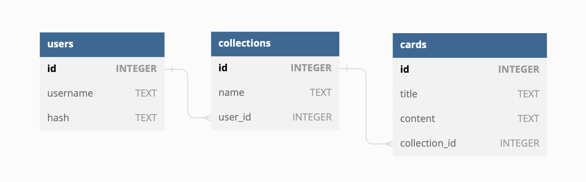

# Flashcards

## Description
Flashcards is a web app for making customized study cards.
<br>
The user creates the collections and, for each collection, the related study cards.
<br>
Collection cards presented without the content at first, to allow the user to test himself.
<br>
There is also a registration system, authentication and a password-changing option.

This web application based on Flask framework, using relational DB with SQLite.
<br>
The client side implements AJAX concepts using jQuery JavaScript library.

## Demo
https://youtu.be/Ft2HY2mb088

## Getting Started
Clone the repository:
```bash
git clone https://github.com/hanit-com/cs50.git
```

Install the required packages:
```bash
pip install -r requirements.txt
```
## Running:
```bash
python app.py
flask run
```

## Testing:
```bash
pytest
```

## Database

Interact with the local DB:
```bash
sqlite3 project.db
```



## API
**All parameters are required**

#### Get the login page

```http
  GET /login
```
Returns rendered template of "login.html".


#### Log into the app

```http
  POST /login
```
| Parameter | Type     |
| :-------- | :------- |
| `username`| `string` |
| `password`| `string` |

Saves user ID in sesison and redirects to initial page.


#### Get registration page
```http
  GET /register
```
Returns rendered template of "register.html".


#### Register to the system
```http
  POST /register
```
| Parameter | Type     | Description                       |
| :-------- | :------- | :-------------------------------- |
| `username`| `string` | |
| `password`| `string` | |
| `confirmation`| `string` | User input for new password confirmation|

Redirects to initial page.


#### Get initial page
```http
  GET /
```
Returns rendered template of "index.html" if logged in or "login.html" if not.


#### Getting user collections
```http
  GET /collections
```
JSON response.
Internaly usses the session for user ID, no parameters needed.


#### Create new collection
```http
  POST /createCollection
```
| Parameter | Type     | Description                       |
| :-------- | :------- | :-------------------------------- |
| `name`| `string` | Name for the new collection.|

JSON response.


#### Delete a collection
```http
  DELETE /deleteCollection
```
| Parameter | Type     | Description                       |
| :-------- | :------- | :-------------------------------- |
| `id`| `string` | Collection ID.|

JSON response.


#### Get collection page
```http
  GET /collection
```
| Parameter | Type     | Description                       |
| :-------- | :------- | :-------------------------------- |
| `id`| `string` | Collection ID.|

Returns rendered template of "collection.html".


#### Get collection cards
```http
  GET /cards
```
| Parameter | Type     | Description                       |
| :-------- | :------- | :-------------------------------- |
| `id`| `string` | Collection ID.|

JSON response.


#### Delete a card
```http
  DELETE /deleteCard
```
| Parameter | Type     | Description                       |
| :-------- | :------- | :-------------------------------- |
| `id`| `string` | Card ID.|

JSON response.


#### Create a new card
```http
  POST /createCard
```
| Parameter | Type     | Description                       |
| :-------- | :------- | :-------------------------------- |
| `title`| `string` | |
| `content`| `string` | |
| `collection_id`| `string` | The collection the card is related to.|

JSON response.


#### Get password changing page
```http
  GET /changePassword
```

Returns rendered template of "change_password.html".


#### Change password

```http
  POST /changePassword
```
| Parameter | Type     | Description                       |
| :-------- | :------- | :-------------------------------- |
| `current_password`| `string` | |
| `new_password`| `string` | |
| `confirmation`| `string` | |

Redirects to initial page.


#### Log out of the app and redirect to the initial page
```http
  POST /logout
```
Clears the session and redirects to intial page.